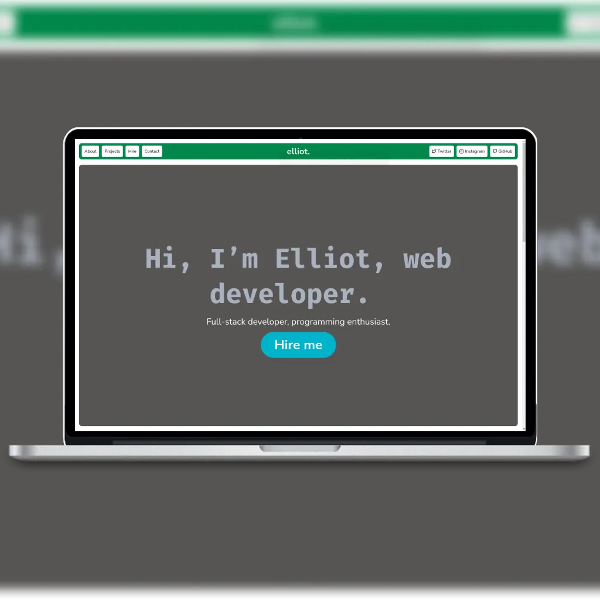

# Portfolio website
This is a portfolio website I made for myself in order to attract more clients and to promote my services on the internet.
Firstly, I made a mock-up of the website in Figma to help me visualise what the website would look like and maintain consistency across the website.
After that, I used HTML and CSS to make the website according to the mock-up that I had made. I wanted to add an animation that imitated writing and running a JavaScript program at the top of the page, so I used CSS & JavaScript to make that animation.

## License
The source code is provided under the [GNU AGPL v3](https://www.gnu.org/licenses/agpl-3.0.en.html) license.